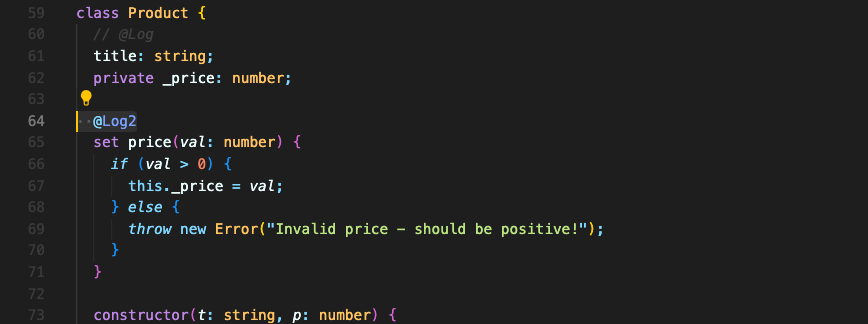
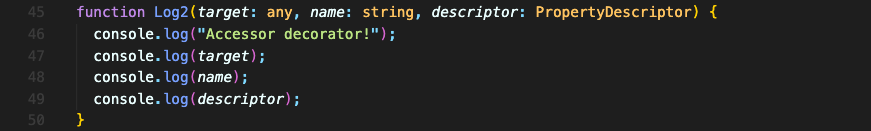
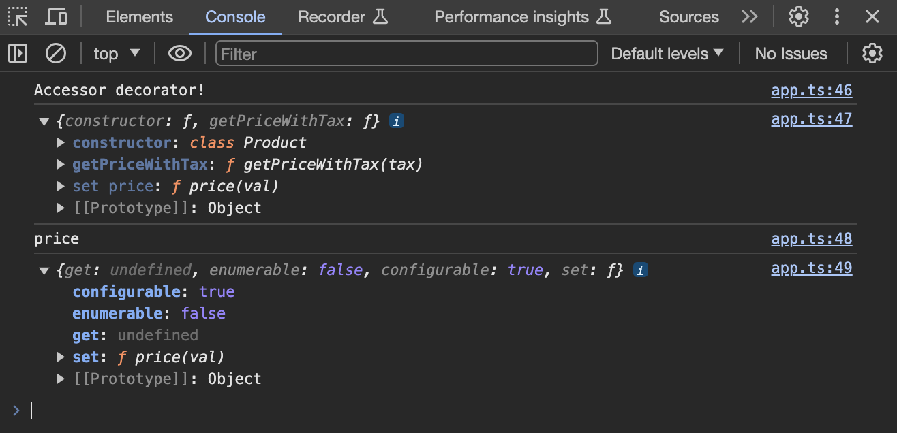
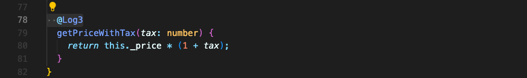
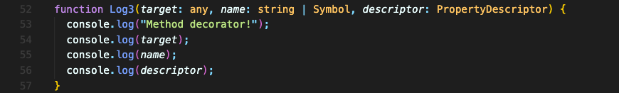
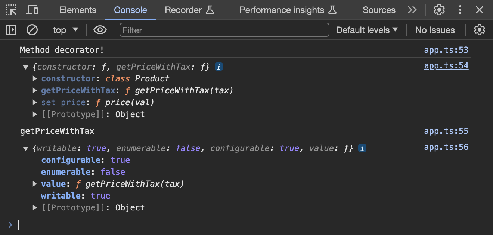
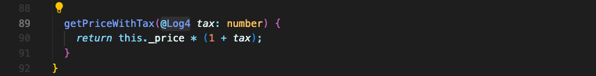
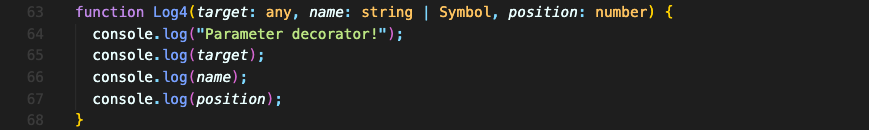
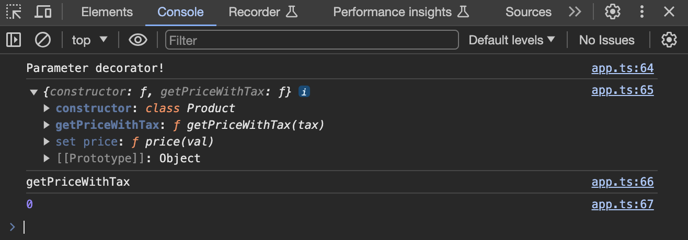

# Accessor & Method & Parameter 데코레이터

`set`과 같은 Accessor와 Method, Parameter에도 데코레이터를 더할 수 있습니다.

### Accessor 데코레이터
먼저 Accessor 데코레이터를 추가해보겠습니다.

3개의 파라미터를 받습니다.

콘솔 로그로 찍힌 내용을 확인해보면 다음과 같습니다.

### Method 데코레이터

Method에도 데코레이터를 추가해보겠습니다.

`Product` 클래스 내부의 메서드입니다.

Accessor 데코레이터와 마찬가지로 3개의 파라미터를 받습니다.

콘솔 로그로 찍힌 내용을 확인해보면 다음과 같습니다.

### Parameter 데코레이터

마지막으로 Parameter 데코레이터를 추가해보겠습니다.

3개의 파라미터를 받습니다.

`target` 파라미터는 똑같고, `name` 파라미터는 파라미터의 이름이 아니라 메서드의 이름을 말합니다. 마지막으로 `position`을 받는데 이건 파라미터가 몇번째 파라미터인지 숫자로 알려줍니다.

데코레이터는 인스턴스를 만들 때가 아니라, 클래스가 정의될 때 실행됩니다.

 