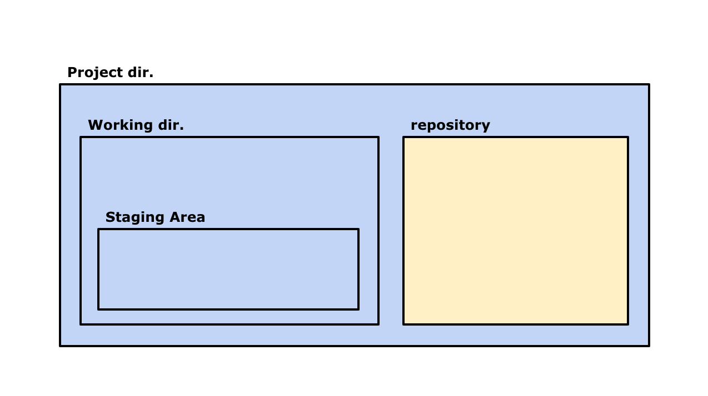

# git에 대한 이해

## git?
어떤 파일을 작성하고 저장하다보면 자연스럽게 버전관리의 필요성을 느끼게 됩니다.  
비단 코드에서만 국한되는 일은 아니지만, 많은 양의 코드 파일을 수정하고 공유하는 개발자들은 그 필요성을 더욱 실감합니다.  

git(깃)은 가장 유명한 [버전관리시스템](https://git-scm.com/book/en/v2/Getting-Started-About-Version-Control)(VCS: Version Control System)중 하나입니다.  
git은 중앙집중식 방식이 아닌 분산 버전 관리 시스템(DVCS: Distributed Version Control Systems)을 사용하기 때문에 안전하게 데이터를 보관할 수 있습니다.

## git status
git을 사용하기 위해서는 꼭 이해해야 하는 3가지 상태가 있습니다.  
* Modified
* Staged
* Committed

상태를 이해하기 위해 여기서부터는 약간의 상상력이 필요합니다.  

우리가 파일을 작성하는 디렉토리(폴더)를 하나 가지고 있다고 합시다. 그리고 그 폴더에는 test.txt 파일이 하나 들어 있습니다.  
우리는 이 디렉토리를 git으로 버전관리 하려 합니다.

그렇게 하기 위해서 해당 디렉토리 내부를 git으로 초기화 합니다.(이 방식에 대해선 다음에 다룰 것입니다.)  
그러면 디렉토리 내부에는 repository라는 공간이 생깁니다. 이 곳에 우리의 버전 기록이 담길 것입니다.  

지금 디렉토리 내부에 있는 test.txt 파일은 계속 내용이 수정될 것입니다. 파일이 수정된 상태가 Modified 상태입니다.

수정이 완료된 파일은 새로운 버전으로 기록되어야 합니다. 최종적으로 이 파일의 버전 기록은 같은 디렉토리 내부에 있는 repository라는 곳에 담기게 됩니다. 이곳에 저장하는 행위를 commit이라 부르고, 이곳에 안전하게 저장된 상태가 Committed 상태 입니다.

### 디렉토리 구조
||
|:--:|
|디렉토리 구조|

여기서 빠진 설명이 하나 있습니다.  
사실 수정된 파일을 바로 commit 할 수는 없습니다. 
디렉토리의 파일을 commit 하기 위해서는, 우리는 보이지 않지만 stage라는 가상의 공간이 있다고 생각해야 합니다.  
다시말해, 디렉토리의 파일이 이 stage를 거쳐야만 commit을 할 수 있습니다.  
**쉽게 생각하면, test.txt 파일을 잠시 stage에 올려뒀다가 repository에 기록하는 것입니다.**
이 stage에 올려 둔 상태를 Staged 상태입니다. stage에 있는 파일들만이 곧 commit될 것이라고 표시한 것입니다.

* Modified: 수정한 파일을 아직 로컬 데이터베이스에 커밋하지 않은 것
* Staged: 현재 수정한 파일을 곧 커밋할 것이라고 표시한 상태를 의미
* Committed: 데이터가 로컬 데이터베이스에 안전하게 저장됐다는 것을 의미

||
|:--:|
|Git Status with Working tree, Staging Area, Git Directory.|

마지막으로 정리하면, 위의 그림에서 봤을때

* Working Directory에서 파일을 작업한 상태가 Modified.
* 작업한 파일을 Staging Area에 올려 놓은 상태가 Staged.
* commit을 해 .git directory(repository)에 파일의 버전 기록을 저장한 상태를 Committed.

라고 생각하면 됩니다.

