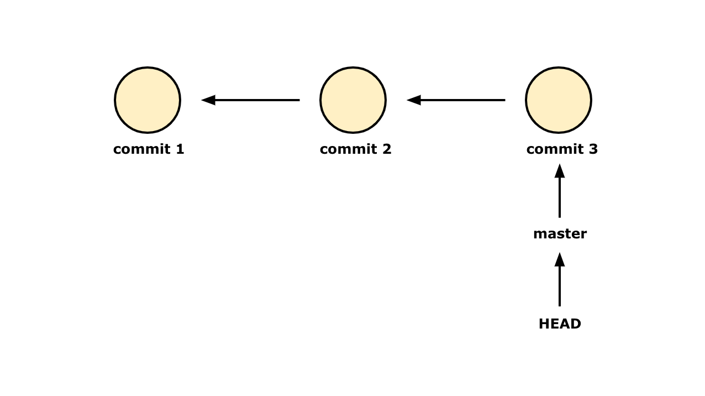
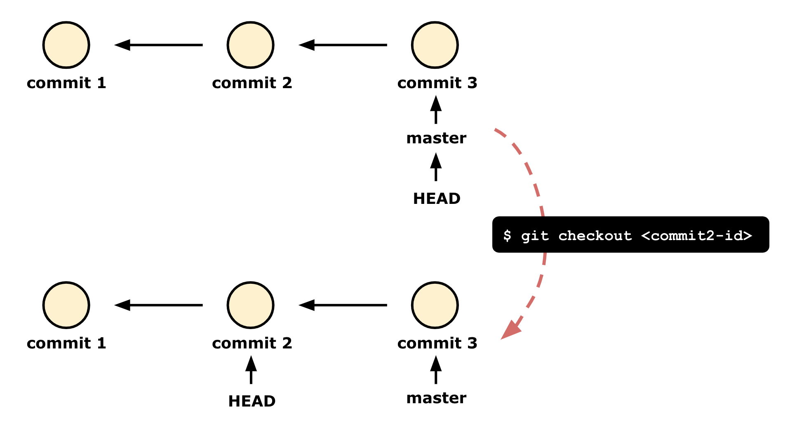
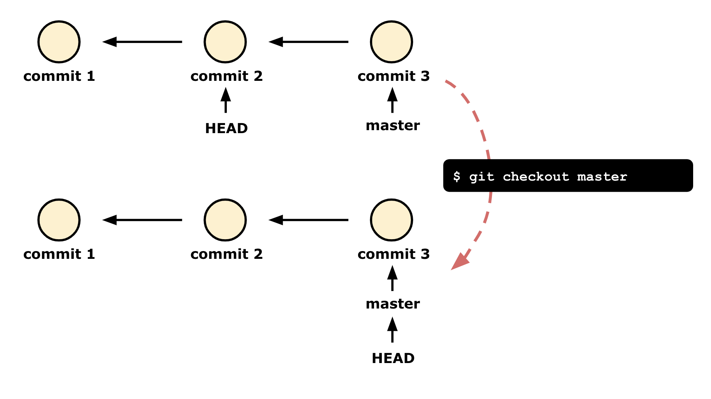
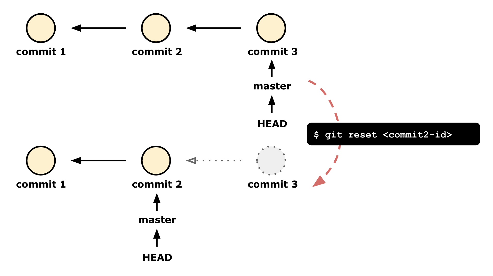
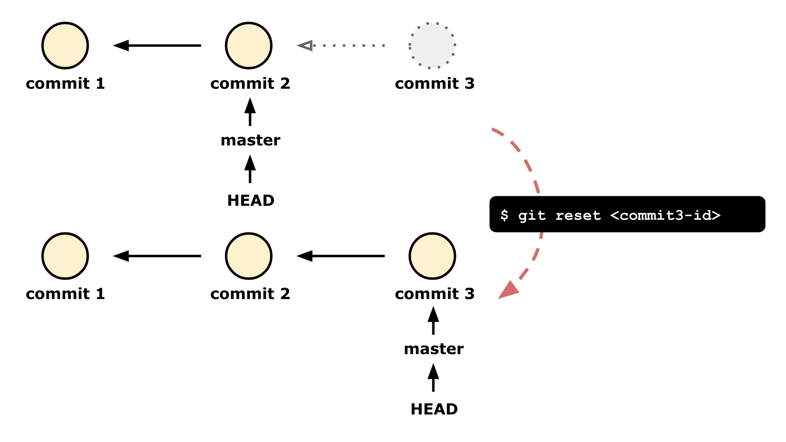

# git 기본 사용법

<br>

## commit, master, head의 관계
||
|:--:|
|디렉토리 구조|

<br>

git을 사용하기 위해서는 commit, master, head의 관계를 이해하는 것이 중요합니다.  
명령어를 사용하기에 앞서, 각 요소들이 지니는 특성을 간단하게 살펴봅니다.

위의 그림은 시간 순서대로 commit1, commit2, commit3가 생성된 상태이며, 커밋간의 화살표 방향은 자식에서 부모커밋 방향으로 가리키고 있습니다.  
master는 commit3를, HEAD는 master를 가리키고 있습니다.

<br>

### master
**커밋을 하면 master는 항상 마지막 커밋을 가리킵니다.**  
위 그림에선 commit3가 마지막으로 한 커밋이기 때문에 master는 commit3를 가리킵니다.

<br>

### HEAD
git에서는 수정된 내역들이 나타내는 공간(unstaged files)을 워킹카피(Working Copy)라고 말합니다. 쉽게 생각하면, 지금 내가 보고있는 버전의 파일이라고 생각하면 됩니다.

**HEAD는 나의 워킹카피가 어디에서 유래되었는지에 대한 것이며 그곳을 가리킵니다.** 위 그림에서 HEAD는 master를 가리키고 있고, 그 master는 commit3를 가리키고 있기 때문에 우리는 commit3 상태의 파일들을 볼 수 있습니다.  
워킹카피는 무조건 HEAD가 있는 위치라고 생각하면 좋습니다.

<br>

### commit
**commit은 HEAD를 근거로 생성됩니다.** commit을 하면 헤드가 향해 있는 곳에서부터 commit이 생겨납니다.

위의 그림과 같은 상태에서 새롭게 커밋을 한다면, commit3를 부모로 가리키고 있는 commit4가 생기게 됩니다. HEAD는 master를 가리키고 있고, master는 commit3를 가리키고 있기 때문입니다. commit4가 commit3 다음에 생기는 이유가 바로 이것입니다.

즉, commit은 commit이 만들어지는 시점에 헤드가 가리키는 commit을 부모로 지칭합니다.

|||
|:--:|:--:|
|`commit3` 완료 상태|`commit4` 완료 상태|

commit3에 있던 master와 HEAD도 commit4가 생성됨에 따라 함께 이동한 모습을 볼 수 있습니다. master가 최신 커밋으로 이동했고 HEAD는 master를 가리키고 있기 때문입니다.

<br>
<br>

## 명령어

<br>

### init
||
|:--:|
|git을 사용하는 디렉토리 구조|

처음 디렉토리에 버전 관리를 시작할 때 사용합니다.  
위의 그림과 같이 프로젝트 디렉토리 최상단에 git repository를 만들어 버전을 관리합니다. 
```bash
git init
```
최상단에서 이 명령어를 사용하면 repository(=.git파일)이 생성됩니다. 프로젝트 디렉토리 안에 있는 모든 파일에 대한 버전 관리 준비가 끝났습니다.

<br>

### status
git은 상태에 따라 다른 기록을 하기 때문에, 현재 어떤 상태로 파일들이 관리되고 있는지 알고 있는 것이 중요합니다.  
어떤 파일이 수정되었고, staging 되었는지 확인할 수 있는 명령어가 `status`입니다.
아래와 같이 입력하면 현재 상태를 파악할 수 있습니다.
```bash
git status
```

<br>

### add
파일을 stage에 올리는 명령어입니다.  
다시 말해, Staged 상태로 만들기 위해서는 이 명령어를 사용하면 됩니다.
```bash
git add <file name>
git add . # 모든 파일을 staging하고 싶다면 현재 경로를 표시하는 . 하나면 됩니다!
```

<br>

### commit -m
Staged 상태의 파일을 커밋할 때 사용하는 명령어입니다.  
Modified 상태의 파일들은 커밋되지 않고, Staged 상태의 파일들만 커밋됩니다.  
`git commit` 명령어 뒤의 `-m`은 커밋 메세지를 작성할 때 사용하며, 일반적으로 변경사항에 대해 한눈에 [알아보기 쉽게 작성](https://hackwild.com/article/semantic-git-commits/#:~:text=They%20help%20to%20clarify%20the,implement%20new%20features%20for%20endusers)합니다.
```bash
git commit -m <commit message>
git commit -m "feat: add auth component"
```

<br>

### commit --amend
커밋을 수정하고 싶을 때도 있습니다.  

예를 들어, 이전 커밋 내용에 함께 추가했어야 하는 내용을 빠뜨렸다고 합시다.  
먼저, 추가할 내용을 모두 작성하고 staged 상태로 만듭니다(add 까지 한 상태). 그 다음 아래의 명령어를 사용해 이전 커밋의 내용과 합칩니다. 커밋 메세지도 다시 작성할 수 있습니다.
```bash
git commit --amend
```
커밋 메세지를 수정하고 싶은데, 위와 같이 입력하면 vim 창이 따로 켜지고 그 안에서 커밋 메세지를 수정해야 합니다.

번거롭다면 아래와 같이 한 줄의 명령어로 커밋 메세지 또한 한번에 수정할 수 있습니다.
```bash
git commit --amend -m <commit message>
```
log를 보면 이전 커밋 메세지가 변경된 것을 볼 수 있습니다.  
추가할 파일 내용 없이, 커밋 메세지만 수정하고 싶을 때에도 이 방법을 사용할 수 있습니다!

<br>

### log
커밋 내역을 확인하는 가장 일반적인 방법은 `log`를 사용하는 것입니다.  
```bash
git log
```
유용하게 사용하는 옵션은 다음과 같습니다.
```bash
git log --oneline # log를 간단하게 보여줍니다.
git log -n 5 # 특정 갯수만큼 커밋을 보여줍니다.
```

<br>

### reflog
git에서 사용한 이전 모든 로그를 볼 수 있습니다.  
`git reset`, `git rebase` 명령어로 삭제된 커밋을 포함한 모든 커밋의 히스토리를 보여줍니다.
```bash
git reflog
```

<br>

### show
가장 최근의 커밋이나, 특정한 커밋의 자세한 정보를 볼 수 있습니다.  
```bash
git show # 가장 최근의 커밋에 대한 정보를 보여줍니다.
git show <commit-id> # 특정 커밋에 대한 정보를 보여줍니다.
```

commit-id 대신에 HEAD 포인터를 많이 사용합니다.  
바로 전 커밋을 가리키고 싶다면 commit-id 대신 `HEAD^` 또는 `HEAD~`를 사용하면 되며,  
3개 전 커밋을 가리키고 싶다면 `HEAD^^^` 또는 `HEAD~3`을 사용하면 됩니다.


<br>

### checkout
```bash
git checkout <commit-id or branch>
```
**`checkout`은 HEAD를 이동시킵니다.**  
**디렉토리 상태를 해당 커밋의 스냅샷 상태로 이동시킵니다.** 덕분에 `checkout`을 이용해 우리는 시간 여행을 할 수 있습니다.  
||
|:--:|
|checkout으로 HEAD를 commit2로 이동|

시간 여행이 끝난 후, 다시 작업을 하고 커밋을 하기 위해서는 master(또는 다른 이름의 branch)로 checkout을 해야합니다.
||
|:--:|
|checkout으로 HEAD를 master로 이동|

master과 HEAD가 합쳐져 새로운 커밋을 작성할 준비가 되었습니다.

### checkout 주의사항  
위에서 본 것처럼 HEAD를 master와 분리해 다른 커밋으로 `checkout`한 뒤, 마지막 커밋으로 다시 HEAD를 돌리고 싶을 때가 있습니다.  
이때, HEAD를 마지막 커밋으로 `checkout`하게 되면 HEAD와 master가 분리됩니다. 때문에 HEAD를 버전 자체로 `checkout`하면 안됩니다.

대신, master를 향해 `checkout`하면 다시 master와 HEAD가 뭉치게 됩니다.  
master는 마지막 커밋을 가르킴으로 다시 원래대로(원하는 방향으로) 커밋을 진행할 수 있습니다.

<br>

### reset
```bash
git reset <commit-id>
```
`reset`은 master를 이동시킵니다. master을 가리키고 있는 HEAD도 함께 이동하기 때문에 디렉토리엔 이전의 상태만 남게 됩니다.
||
|:--:|
|reset으로 master를 commit2로 이동|

`reset`은 복합적입니다. `checkout`을 포함하는 개념이기 때문입니다.  
`reset`을 사용해 이전 버전으로 되돌아 간다면 디렉토리에 후 버전이 사라진 것처럼 보입니다. 실제로 사라진 것이 아니라, 사라진 커밋을 가리키는 것이 아무것도 없기 때문에 보이지 않을 뿐입니다.  
이럴 때 다시 `reset`을 사용해 마스터로 하여금 사라진 커밋을 가리키게 하면 이전과 같이 돌아갈 수 있습니다.
||
|:--:|
|reset으로 master를 commit3로 이동|

<br>

### remote
remote 컴퓨터에 local 컴퓨터의 작업을 옮기는 것을 backup한다고 말합니다.  
backup을 하기 위해 git에서는 `remote` 명령어를 사용해 remote 저장소를 추가합니다.
```bash
git remote add <remote-name> <remote-url>
git remote add origin https://github.com/....
```
참고로, 원격저장소를 임대해 주는 서비스를 git hosting 서비스라고 합니다.  
우리가 많이 사용하는 github도 그 중 하나입니다.

<br>

### push
remote 저장소에 commit들을 올릴 때 `push` 명령어를 사용합니다.
```bash
git push <remote-name> <branch-name>
git push origin master
```

<br>

### pull
remote 저장소에서 데이터를 가져오려면 `pull` 명령어를 사용합니다.  
협업 시, 작업 전에 `pull`을 사용해 변경 사항을 당겨 오면 됩니다.  
`pull` = `fetch` + `merge` 라고 생각하면 됩니다.
```bash
git remote add <remote-name> <remote-url>
```

<br>

### clone
Clone은 이미 존재하는 저장소를 복제해서 내 컴퓨터에 가져오는 것입니다.  
저장소를 히스토리와 더불어 전부 복제합니다. 서버에 문제가 생기면 이 복제물로 다시 작업을 시작할 수 있습니다.
```bash
git clone <remote-url>
git clone https://github.com/...
```
참고로, 저장소를 Clone 하면 리모트 저장소를 자동으로 “origin” 이라는 이름으로 추가합니다.