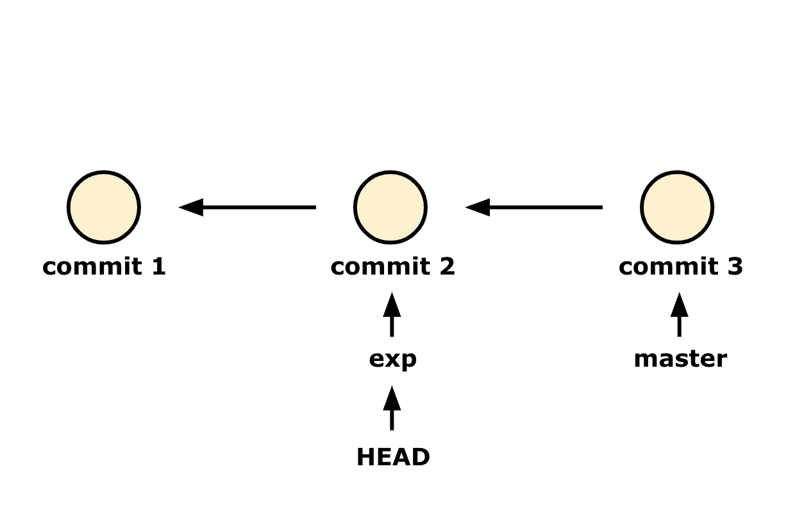

# git branch

## branch(브랜치)?
개발을 하다 보면 새로운 기능을 추가해야 할 때가 많습니다. 안정적인 기존 코드에 실험적인 새로운 기능을 추가하는 것은 위험 부담이 큰 일입니다. 때문에, 기존 코드를 복사해 그 위에서 작업하는 일이 생깁니다.  
**원래 코드는 그대로 둔 채, 독립적으로 복사한 코드에 개발을 할 수 있는 것이 '브랜치' 입니다.**

git은 기본적으로 `master` 브랜치를 만듭니다. 많은 프로젝트에서 `master` 브랜치가 존재하는 이유는 초기에 `git init` 명령어로 초기화를 하며 `master` 브랜치가 자동으로 만들어지고 굳이 바꾸지 않기 때문입니다.

`master` 브랜치는 처음 커밋을 하면 그 커밋을 가리킵니다. 이후에 커밋을 만들면 `master` 브랜치는 가장 마지막에 만들어진 커밋을 자동으로 가리키게 됩니다.  
브랜치와 HEAD, 커밋은 관계성을 가지고 작동하기 때문에, 브랜치에 대해 이해하려면 [이 셋의 관계에 대한 이해](https://github.com/koanko-dev/TIL/blob/main/git/02_git_basic.md#commit-master-head%EC%9D%98-%EA%B4%80%EA%B3%84)가 필요합니다.

<br>
<br>

## 새로운 브랜치 생성
git에는 `branch` 명령어가 있습니다.  
먼저 이 명령어로 브랜치를 확인해봅시다.


`master` 브랜치만 존재하기에, `master` 브랜치만 표시됩니다. `master` 앞에 * 표시는 `HEAD`의 위치를 의미합니다. `HEAD`는 현재 `master`를 가리키고 있습니다.

<br>


지금 우리는 commit3 까지 작업을 한 상태라고 가정해봅시다. 아무 브랜치를 만들지 않았으니 이 작업들은 당연하게도 초기 브랜치인 `master` 브랜치에서 작업이 되었을 겁니다.  

<br>

이제, 이전의 모든 커밋을 유지한 채 새로운 실험을 할 브랜치를 새로 만들어봅시다.  
새로운 브랜치 이름을 `branch` 명령어 뒤에 작성하면 브랜치가 생성됩니다.  
실험용 브랜치로 `exp` 브랜치를 생성합니다.


`exp` 브랜치가 성공적으로 생성된 것을 확인할 수 있습니다. 하지만 `master` 앞에 * 표시를 볼 수 있듯이, 지금 `HEAD`는 아직 `master` 브랜치를 가리키고 있습니다.

<br>

`HEAD`가 새로운 `exp` 브랜치를 가리키도록 `checkout` 합니다.

exp 브랜치로 전환되었다는 메세지와 함께 명령줄에 `git:(master)`가 `git:(exp)`로 바뀐 것을 볼 수 있습니다.

<br>

`exp` 브랜치가 새로 생성되고 `exp` 브랜치에 `checkout` 명령어를 사용하면서, 아래의 그림과 같은 상태가 되었습니다.


<br>

여기에서 새로운 커밋을 추가하게 되면 다음과 같이 커밋이 진행됩니다.


<br>

실험적인 작업을 잠시 중단하고 기존 작업에만 급하게 추가해야 할 내용이 있다면, 다시 `master` 브랜치로 이동해 커밋을 할 수 있습니다.  
그럼 아래와 같이 커밋이 생성됩니다.

이제 브랜치 사이를 쉽게 오가며 원하는 버전에서 작업할 수 있게 되었습니다.

<br>
<br>

## 브랜치는 어느 위치에서 생성되는가?
위의 예시에서 우리는 commit3 에 `git branch` 명령어로 브랜치를 생성했습니다.  
commit3 에서 새로운 브랜치가 생성된 건, **브랜치는 `HEAD`의 위치를 기반으로 생성되기 때문입니다.**  
commit3를 향해 `master` 브랜치가 있었고, 그 `master` 브랜치로 `HEAD`가 향해 있었기 때문에 commit3에 새로운 `exp` 브랜치가 생겼던 것입니다.

만약 위의 예시와 같이 마지막 커밋인 commit3가 아닌, 이전 커밋에서 브랜치를 시작하고 싶다면 어떻게 해야 할까요?  
네, `HEAD`를 commit2로 옮긴 뒤 브랜치를 생성하면 됩니다!

<br>

```bash
git checkout <commit2-id>
```

`master` 브랜치를 가리키고 있던 `HEAD`가 commit2 로 이동했습니다.

`HEAD`가 commit2를 가리키고 있으니 이제 브랜치를 만들면 됩니다.

```bash
git branch exp
```

`exp` 브랜치가 commit2에 생성되었습니다.

지금 `HEAD`는 브랜치와 분리되어 commit2를 가리키고 있는 상태입니다. 작업하기 위해 다시 브랜치를 가리키도록 합니다.

```bash
git checkout exp
```

`HEAD`가 `exp` 브랜치를 가리킵니다. 이제 `exp` 브랜치에서 작업할 준비가 끝났습니다.

새로운 커밋을 하면 다음과 같이 커밋이 생성됩니다.
