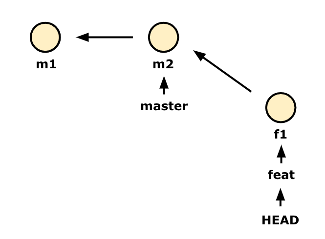
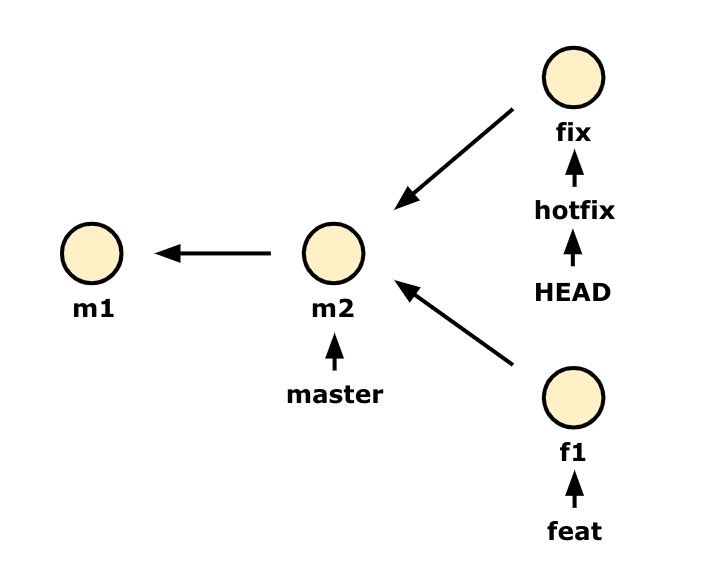
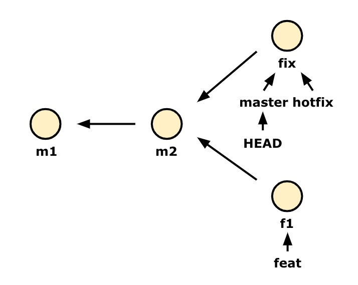
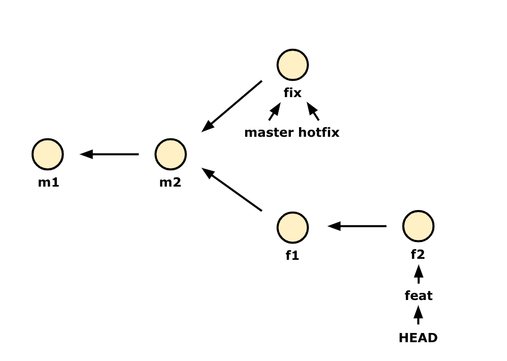
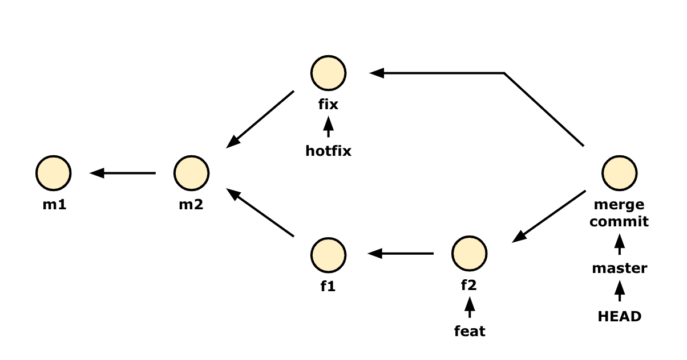
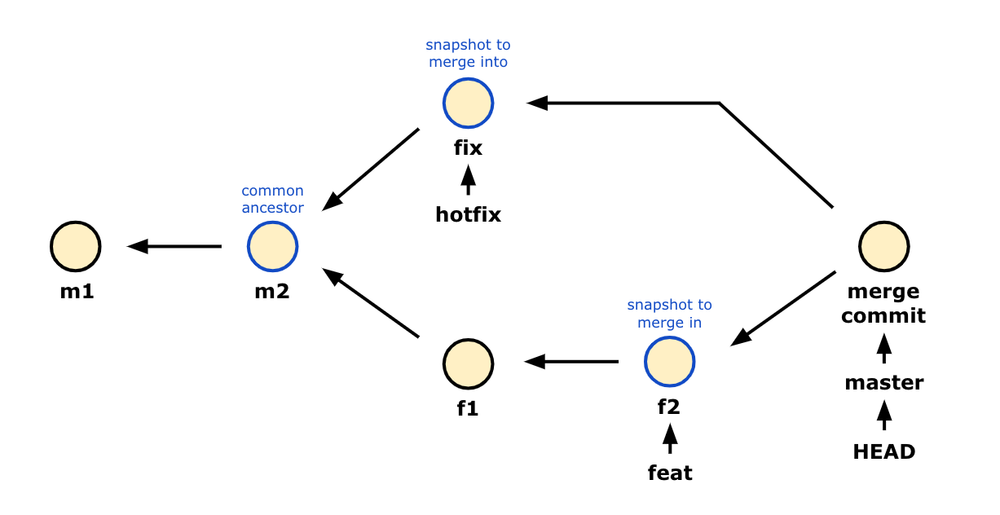
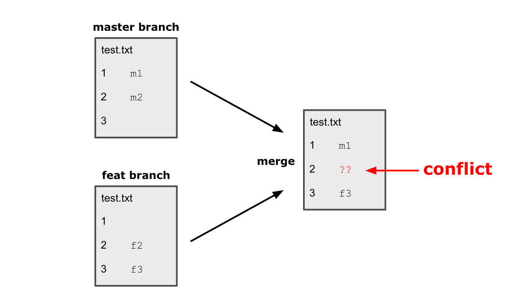
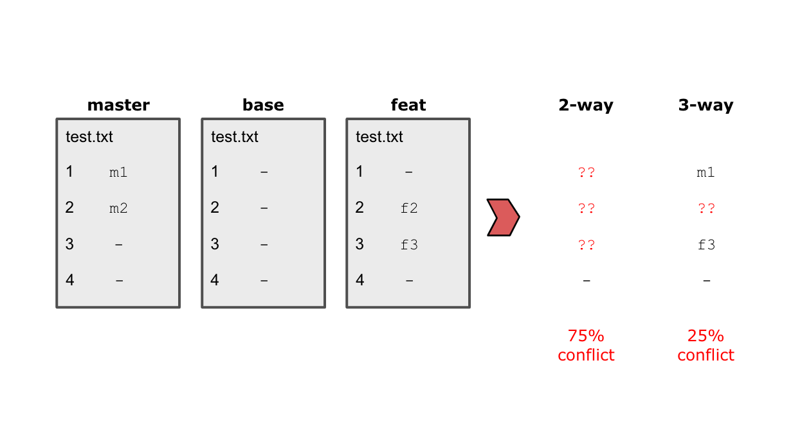

# git merge

## merge
새로운 기능을 추가하기 위해 브랜치를 만들고 작업을 하다가 그 작업을 기존 브랜치에 반영해야 할 때가 있습니다.  
**브랜치들을 하나의 브랜치로 합치는 것을 `merge` 라고 합니다.**

git에서는 브랜치를 합칠 때 오토머징(auto merging)을 할 수 있습니다. 한 가지의 commit만을 머징하지 않고 브랜치가 가지고 있는 모든 커밋을 다같이 머징할 수 있습니다.

### merge의 종류
* Fast-forward
* 3-way merge(conflict situation or not)

두가지 방식에 대해서는 아래에서 예시를 통해 살펴볼 것입니다.

<br>

`master` 브랜치로 작업을 하다가, 새로운 기능을 추가하기 위해 새롭게 `feat` 브랜치를 만들었다고 가정해봅시다.  
새로운 `feat` 브랜치에서 작업을 하고, 하나의 커밋 f1을 남겼습니다.  


그러다 기존 코드에서 급하게 수정해야 할 부분을 발견합니다. 수정을 하기 위해 m2 커밋까지의 내역을 담은 `hotfix` 브랜치를 만듭니다.  
`hotfix` 브랜치에서 수정사항을 담은 fix 커밋을 남겼습니다.


수정사항을 대표 브랜치인 `master` 브랜치에도 반영해야 합니다.  
`master` 브랜치로 `HEAD`를 옮기고 `hotfix` 브랜치와 merge 합니다.
```bash
git merge hotfix
``` 


merge 가 성공적으로 완료되었습니다. `master` 브랜치는 이제 fix 사항이 반영되었습니다.  
명령줄을 입력한 곳을 보면, `Fast-forward` 라는 메세지가 뜹니다. `hotfix` 브랜치가 가리키는 fix 커밋이 m2 커밋에 기반하기에 `master` 브랜치는 그저 최신 커밋으로 이동한 것입니다.  
**Fast-forward는 별다른 merge 과정 없이 변경사항을 적용하는 방식을 의미합니다.**  
이렇게 우리는 첫번째 방식인 Fast-forward를 경험했습니다.

돌아와서 계속 진행해보겠습니다.  
급한 수정사항을 처리했으니, 다시 `feat` 브랜치로 이동해 작업을 재개합니다.  
새로운 기능에 대한 작업을 완전히 마무리하고 f2 커밋을 남겼습니다.


이제 남은 해야할 일은, 이 새로운 기능을 master 브랜치에 추가하는 것입니다.  
`HEAD`를 merge의 주체가 될 브랜치인 `master` 브랜치로 옮기고 `feat` 브랜치와 merge 합니다.
```bash
git merge feat
``` 
그럼 `feat` 브랜치에서 만든 새로운 기능과 fix 사항이 담긴 새로운 커밋이 자동으로 생성됩니다.


이 때, 마지막으로 만들어진 새로운 merge commit은 어떤 방식으로 생성될까요?


merge commit은 **'부모로 하는 커밋 2개'와 '공통된 조상커밋 하나', 총 3개를 비교해 만들어졌습니다.**  
**이 방식이 merge의 두번째 방식인 3-way merge 입니다.**  

<br>

### conflict
위의 예시와 같이 브랜치를 merge 했을 때, git에서는 자동으로 커밋이 생성되도록 설계되어 있지만 실제로 merge를 사용하다보면 merge commit이 자동으로 생성되지 않을 때가 많습니다. 이유가 무엇일까요?

**merge 하려는 두 브랜치가 같은 파일 이름을 가질 경우, 그 파일의 같은 위치에 내용이 있다면 충돌이 일어납니다. 이것이 conflict 입니다.**  


git이 부모가 되는 두 커밋의 내용 중 어떤 내용을 파일의 같은 위치에 담을지 모르기에 당연한 일입니다. conflict가 일어난 경우 자동으로 merge 하지 못하기 때문에 새로운 커밋이 생성되지 않습니다.  
반대로, 같은 위치에 내용이 겹치지 않는다면 알아서 merge해 새로운 커밋이 생성됩니다.

충돌이 일어난 파일은 unmerged 상태로 표시됩니다.  
conflict가 일어나면 충돌되는 행 외에는 모두 자동으로 merge 하기에 충돌되는 부분만 수정하면 됩니다.  
```javascript
<<<<<<< HEAD:test.txt // -> 내가 체크아웃한 브랜치

m2 // master 브랜치의 내용

======= // 구분선

f2 // 같은 자리에 있는 feat 브랜치의 내용

<<<<<<< feat:test.txt // -> 병합한 브랜치
```
conflict가 발생하면 해당 파일에 들어가서 수동으로 직접 해결하면 됩니다.  
VSC를 포함한 많은 코드에디터들은 어떤 내용을 적용할지에 대한 가이드를 제공하기도 합니다. 이 해결책을 따라도 되고 직접 충돌난 부분에 필요한 내용을 입력해도 됩니다.  
충돌을 해결한 후, 일반적으로 커밋을 만드는 방식과 같이 직접 merge된 부분에 대한 커밋을 생성하면 해결이 완료됩니다.

<br>

### 3-way merge
git의 merge 방식은 [3-way merge](https://blog.npcode.com/2012/09/29/3-way-merge-%EC%95%8C%EA%B3%A0%EB%A6%AC%EC%A6%98%EC%97%90-%EB%8C%80%ED%95%B4/) 입니다. 3-way merge를 하면 conflict가 일어날 확률을 크게 줄여줍니다.
||
|:--:|
|2way, 3way merge 방식의 conflict 확률 비교 예시|

2-way 방식은 마지막 두 커밋을 비교해 같은 부분만 merge 합니다. 3-way 방식은 마지막 두 커밋을 base 커밋(공통된 조상 커밋)과 비교해 충돌되는 부분을 제외하고 merge 합니다.  
위의 예시 그림에서 볼 수 있는 것처럼 3-way merge 방식은 conflict 확률이 확실히 적습니다.

<br>

### merge에 대한 명확한 정리
명확하게 짚고 넘어가야 할 부분에 대해 정리하겠습니다.
- `HEAD`를 병합의 주체가 되길 원하는 브랜치로 `checkout` 후, 병합하고자 하는 브랜치를 `merge` 합니다.
- git은 `merge` 했을 때, conflict가 일어나지 않는다면 자동으로 새로운 merge 커밋을 만들어줍니다.
- `master` 브랜치로 병합을 하든지, `feat` 브랜치로 병합을 하든지 결과는 같습니다. 다만 병합의 주체인 브랜치가 헤드로 지정될 뿐입니다.
- `merge`를 되돌리려면 그 전단계 커밋으로 `reset`하면 됩니다.
- `merge`한 뒤 `feat` 브랜치를 삭제해도 기록은 다 남아있습니다. 이전 가지가 모두 마지막 커밋과 연결되어 있기 때문입니다.
- 새로운 버전/커밋이 없는 상태 즉, 브랜치가 갈라지지 않은 상태에서 `merge` 하게 되면(Fast-forward) 이 경우 새로운 커밋이 만들어지지 않습니다.

<br>