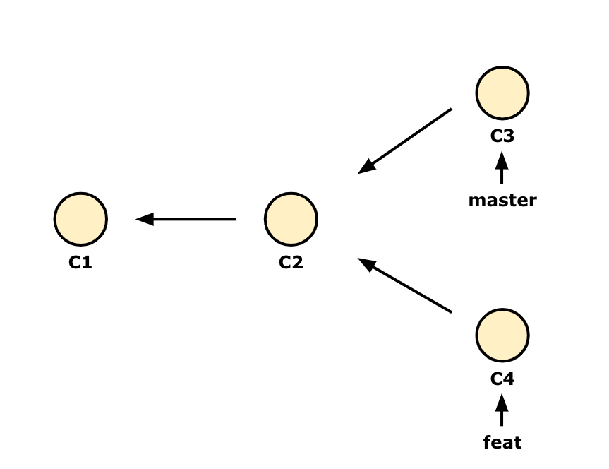
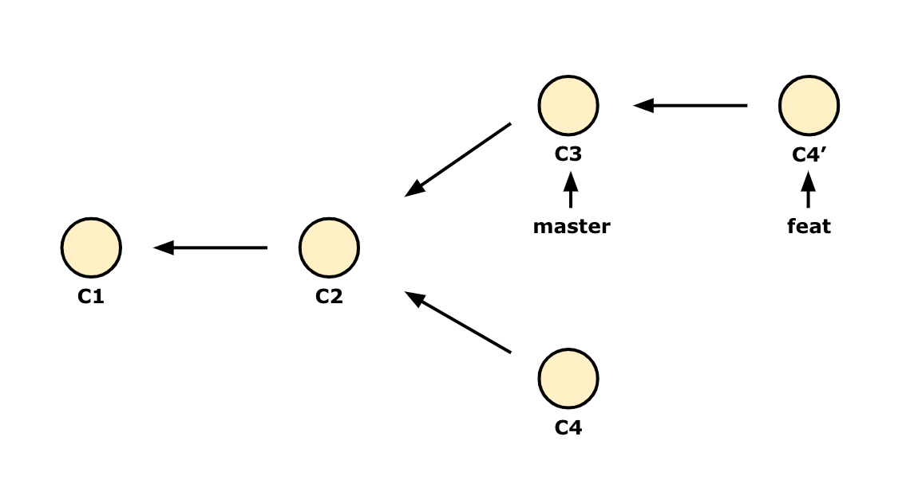

# git rebase

## rebase
두 개의 브랜치를 합치는 방법은 merge 외에도 rebase가 있습니다.  
merge는 두개의 부모 커밋과 공통된 조상 커밋을 사용해 3-way merge 방식으로 새로운 커밋을 만들어 냅니다. **rebase는 한 브랜치의 변경사항을 Patch로 만들어 다른 브랜치 마지막에 적용시키는 방법을 말합니다.**  

<br>

새로운 기능을 추가하기 위해 만든 `feat` 브랜치에서 작업을 완료했다고 합시다.  


rebase는 말 그대로 베이스를 다시 설정한다고 생각하면 됩니다. 그래서 `feat` 브랜치에서 rebase를 실행하면, 새로 추가한 변경사항이 다른 베이스를 기반으로 생성됩니다.  
`master` 브랜치를 기반으로 추가하기 위해 다음과 같이 명령어를 입력합니다.  
```bash
git checkout feat # 변경사항을 담은 feat 브랜치로 이동합니다.
git rebase master # master 브랜치로 rebase 합니다.
```

그럼 feat 브랜치에서 만든 수정사항 즉, C4 커밋이 patch로 만들어져 master 브랜치의 마지막 커밋인 C3 다음에 붙게 됩니다.  
새로 만들어진 C4' 커밋은 C4 커밋의 내용을 담고 있지만 커밋 id까지 똑같은 커밋은 아닙니다.


`master` 브랜치를 Fast-forword 시켜 상태를 업데이트 합니다.  
```bash
git checkout master
git merge feat # Fast-forword
```

<br>
<br>

checkout을 하지 않고도 rebase 할 수 있는 방법이 있습니다.  
rebase 명령어 뒤에 base가 될 브랜치와 base를 바꿀 브랜치를 입력하면 됩니다. 이렇게 하면 위의 그림에서처럼 C4'가 C3뒤에 똑같이 생성됩니다.
```bash
git rebase <base_branch> <topic_branch>
git rebase master feat
```

<br>
<br>

## rebase와 merge
rebase를 하든, merge를 하든 결과물은 같습니다.  
다른 점은, rebase는 커밋 내역을 순서대로 가져와 다른 브랜치에 적용하여 합한다는 것이고, merge는 마지막 두개의 커밋만을 가지고 합친다는 것입니다.  

rebase와 merge 중 어떤 것을 사용해야 할까요?  
사실 이 질문에 대한 답은, "상황에 따라 다르다" 입니다. 팀에서 어떤 정책을 사용할지에 대한 논의를 통해 더 적합한 방식으로 결정해야 합니다.

<br>

### rebase
- 검토하는 프로세스가 단순해집니다.
- 복잡한 기록을 방지합니다.  
- 프로젝트가 어떻게 진행되었는지 쉽게 파악할 수 있습니다.

<br>

### merge
- 간단하고 친숙합니다.
- 새로운 커밋을 추가해 기록 보존합니다.
- 완전한 역사를 보존합니다.

<br>