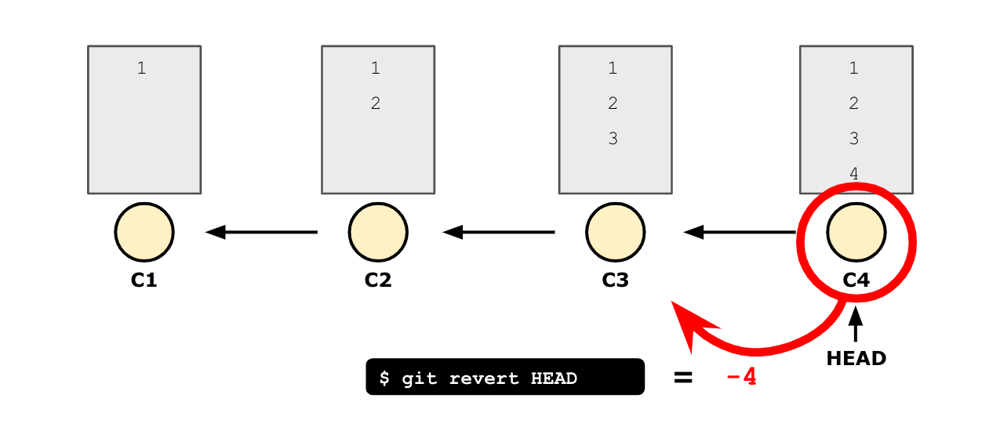
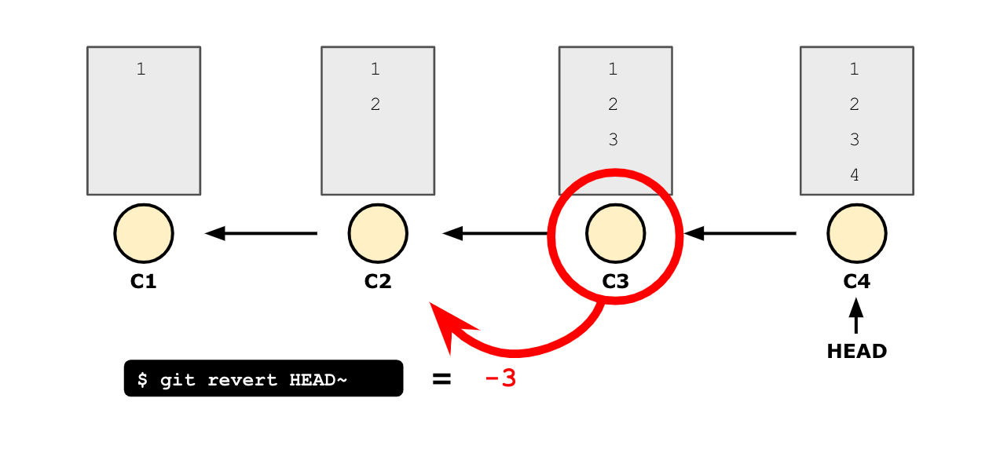
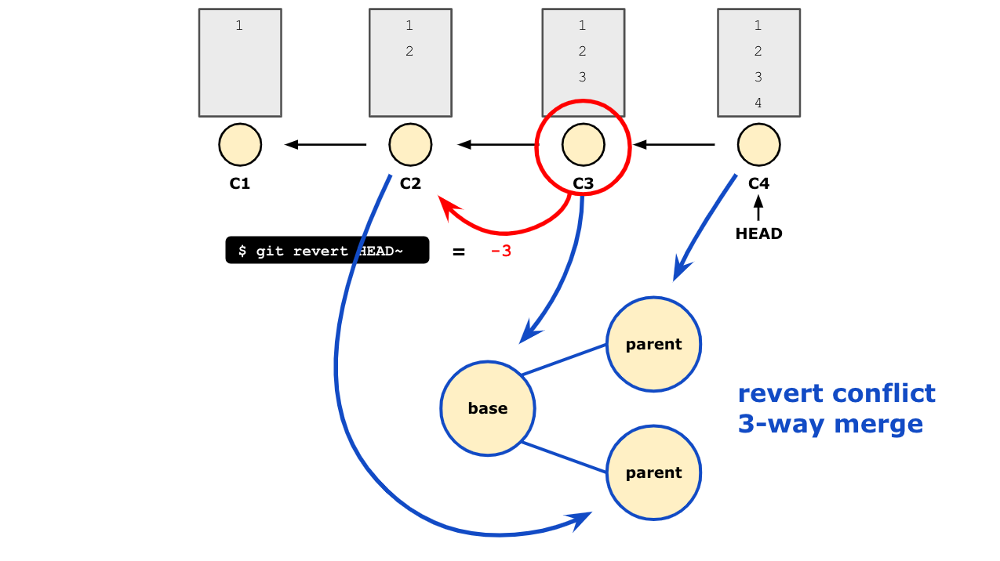
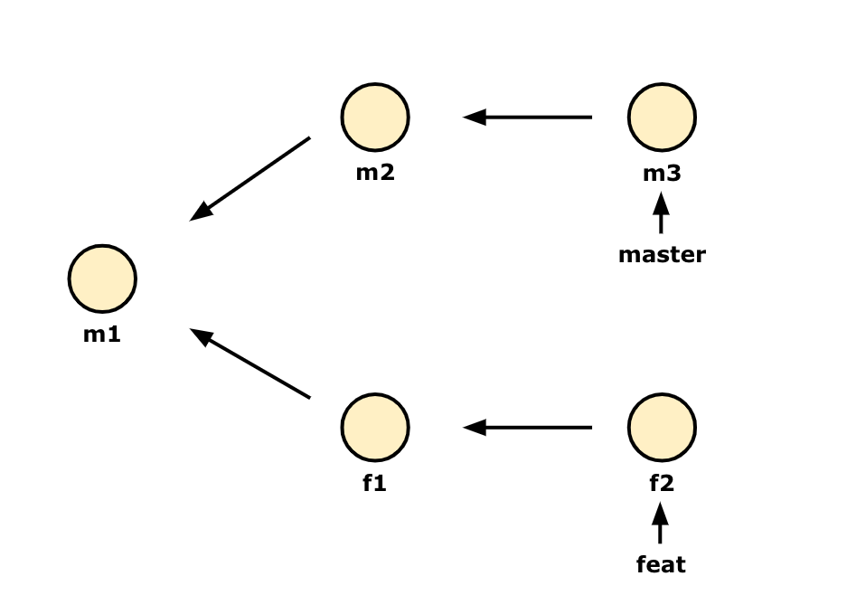
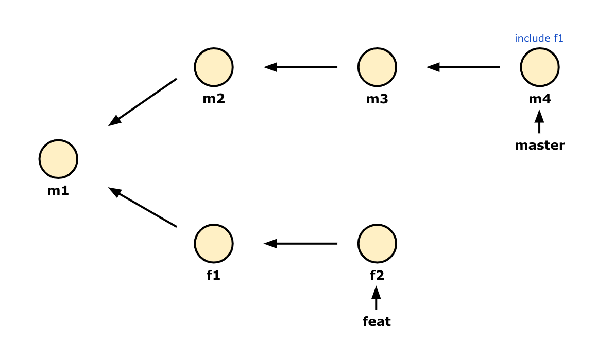

# git revert, cherry-pick

## revert
reset처럼 상태를 되돌리는 것이 아니라, commit하기 이전으로 내용을 빼, 한단계 되돌리는 것을 revert라고 합니다.  
한단계 커밋을 되돌린 상태로 '새로운 커밋'이 만들어집니다.

revert를 사용할 때는 HEAD 포인터를 많이 사용합니다.

<br>

### HEAD 포인터?
HEAD의 위치 기준으로 커밋을 가리키는 방식입니다.  
바로 전 커밋을 가리키고 싶다면 `HEAD^` 또는 `HEAD~`를 사용하면 되며,  
3개 전 커밋을 가리키고 싶다면 `HEAD^^^` 또는 `HEAD~3`을 사용하면 됩니다.  
HEAD 포인터를 사용하면 복잡한 커밋 id를 사용하지 않고도 쉽게 커밋을 가리킬 수 있습니다.

마지막 커밋의 내용을 삭제하고 싶다면 아래와 같이 명령어를 입력합니다.
```bash
git revert HEAD
```

revert는 이전 커밋(=C3)에 비해 revert 대상이 되는 커밋(=C4)에서 변경된 사항을 삭제합니다. 그 다음단계로 위의 그림에서는 나오지 않았지만, 변경사항이 삭제된 커밋 C5를 만들어 C4에 이어 붙입니다.  

<br>

마지막 커밋이 아닌, 특정한 커밋의 내용만을 제거하고 싶다면 어떻게 해야 할까요?  
이 작업으로 인해 원하는 결과는, 커밋들 사이에 있는 하나의 커밋 내용을 되돌리는 것입니다.  
이 때에도 revert를 사용할 수 있습니다.  
예시로 1개 전 커밋의 내용을 지운 새 커밋을 만들어보겠습니다.  
```bash
git revert HEAD~ # 1개 전 커밋(HEAD~)에서의 내용을 제거합니다.
```

revert를 하겠다고 지정한 HEAD~ 는 C3 커밋입니다. C3의 이전 커밋에 비해 변경된 사항은 3 임으로, 3 을 빼게 됩니다.  
이 변경 사항을 반영하여 새 커밋 C5가 C4 뒤에 만들어집니다.

<br>

revert에서 conflict가 났을 때에도, git은 3-way merge를 합니다. 이 때의 3-way merge 방식은  
* revert하는 c3가 base로 지정되며,  
* 마지막 상태(C4)와
* revert하는 c3의 바로 전 커밋(C2)

이렇게 총 3개를 비교하여 merge 합니다.


<br>
<br>

## cherry-pick
`cherry-pick`은 다른 브랜치에서 작업한 커밋 중 내가 원하는 커밋만을 가져올 수 있는 기능입니다.  
`master` 브랜치와 `feat` 브랜치 이렇게 두 브랜치를 가지고 작업을 하는 중에, `master` 브랜치에서 `feat` 브랜치의 특정 커밋 내용을 급하게 반영해야 한다면 `cherry-pick`을 사용해 그 커밋의 내용만을 가져올 수 있습니다.

위의 상황에서 f1 커밋이 필요하다면 이렇게 입력할 수 있습니다.

```bash
git checkout master
git cherry-pick <f1-commit-id>
```

conflict가 나면 해결하여 f1 커밋 내용을 담은 새로운 커밋을 `master` 브랜치 맨 마지막에 붙일 수 있습니다.


<br>