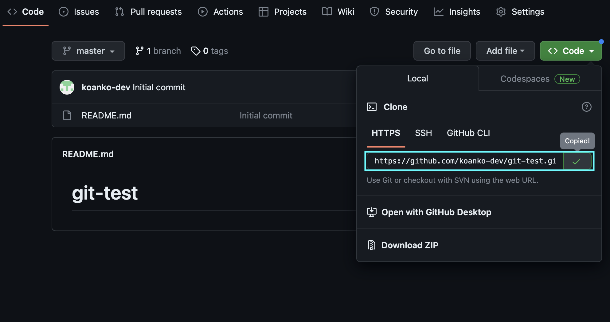
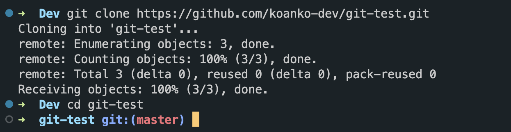
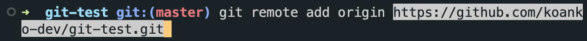
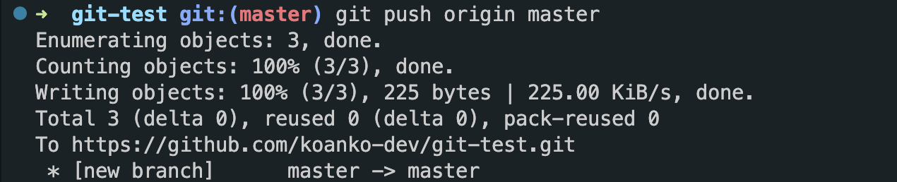
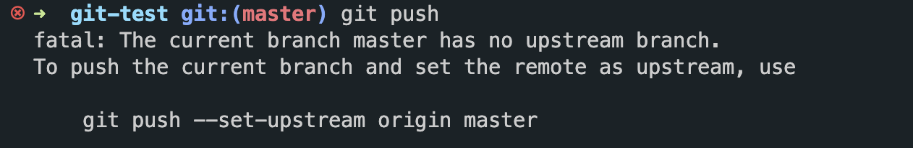
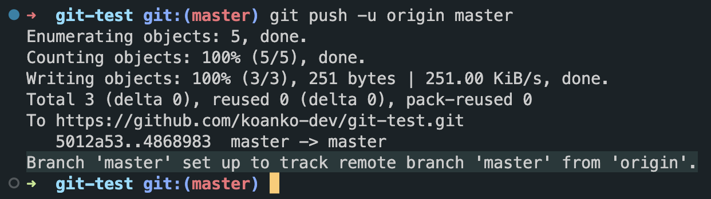

# remote 저장소

## remote 저장소에서의 협업
다수의 팀원과 함께 프로젝트를 진행할 때, 원격 저장소를 사용하는 것은 필수적입니다.  
git을 사용해 버전관리를 하면서 어떤 방법으로 커밋을 할지, 어떤 방식으로 브랜치를 만들고 관리할지에 대해 합의하는 과정이 필요합니다.  
[git-flow](https://jeffkreeftmeijer.com/git-flow/)외에도 방법론의 종류는 다양하지만, 그에 앞서 기본적인 협업 방식을 알아보겠습니다.  

<br>
<br>

## git hosting 서비스
remote 저장소 즉, 원격저장소를 임대해 주는 서비스를 git hosting 서비스라고 합니다.  
우리가 많이 사용하는 [GitHub](https://github.com/)도 그 중 하나입니다.  
git hosting 서비스를 제공하는 곳은 GitHub 외에도 있습니다. [Bitbucket](https://bitbucket.org/)이나 [GitLab](https://about.gitlab.com/)을 사용해도 됩니다. 말 그대로 git hosting 서비스 이기 때문에, git을 사용하는 것은 당연하고 제공하는 기능들도 거의 유사합니다.  

<br>
<br>

## 시작하기
어떤 git hosting 서비스를 사용할지 정했다면, 이제 git으로 관리하는 코드를 올릴 차례입니다.  
저는 가장 대중적인 github을 사용해 관리하는 방법을 작성하겠습니다.  
github에서 계정을 만들고 Repository(저장소)를 만듭니다.  
여기서, 시작하는 방법이 크게 2가지로 나뉩니다.  
* remote 저장소를 만든 뒤, clone(쉽게 말해 다운로드)해 프로젝트 시작하기
* local 저장소를 새로 생성한 remote 저장소에 연결해 시작하기

<br>

### clone하여 프로젝트 시작
Repository를 만들면 그 Repository를 clone 할 수 있습니다.  
해당 Repository에서 url을 복사하여 clone하면 됩니다.


복사한 url로 다음과 같이 명령어를 입력합니다.  
```bash
git clone <remote-url>
```

해당 remote 저장소에 저장된 것을 받아온 것을 볼 수 있습니다. 해당 디렉토리로 이동하면 git init 하지 않아도 바로 사용가능하도록 git 초기화와 `master` 브랜치까지 설정되어 있는 것을 볼 수 있습니다.

<br>

### local 저장소를 remote 저장소에 연결해 시작
기존에 사용하던 local git 저장소를 remote 저장소에 연결하려면 해당 local 저장소에서 다음과 같이 명령어를 입력합니다.
```bash
git remote add <remote-name> <remote-url>
```

remote 저장소를 추가한다는 의미로, 하나의 local 저장소에 여러 remote 저장소를 연결하여 사용할 수도 있습니다.  
remote 저장소를 알아보기 쉽도록 이름을 붙이는데, 여기 remote-name에서 이름을 특정할 수 있습니다. remote-name 은 보통 origin을 통상적으로 많이 사용합니다.  

<br>

추가로, local 저장소와 연결된 remote 저장소를 확인하고 싶다면 아래 명령어를 사용하면 됩니다.  
```bash
git remote -v
```

사용하지 않는 remote 저장소가 있다면 아래 명령어로 remote 저장소와의 연결을 끊을 수 있습니다.
```bash
git remote remove <remote-name>
```

<br>
<br>

## remote 저장소에 올리기(push)
remote 저장소에 local 저장소의 작업물을 올릴 때, push 한다고 합니다.  
push 할 때, 현재 로컬의 내 헤드의 위치, 브랜치의 위치는 중요하지 않습니다.  
remote 저장소에는 브랜치를 따로 만들지 않아도 새로운 브랜치를 push 하면 자동 생성합니다.  
올릴 때는 아래와 같은 명령어를 사용합니다.
```bash
git push <remote-name> <local-branch-name_to_push>
git push origin master
# origin에 Local master 브랜치를 push 합니다.
git push origin a
# origin에 Local a 브랜치를 push 합니다.
```


매번 remote-name과 push 하고 싶은 브랜치 이름을 적는 것은 귀찮은 일입니다.  
그렇다면, upstream을 설정해 간단하게 만들 수 있습니다.

<br>

### upstream & downstream
origin에 있는 브랜치를 칭할 때 upstream 브랜치, local에 있는 브랜치는 downstream 브랜치라고 합니다.  
upstream 설정을 통해 우리가 얻는 것은, local에 있는 특정 브랜치가 원격에 있는 특정 브랜치를 바라볼 수 있도록 짝지어 연결할 수 있다는 것입니다.  
 
`--set-upstream` 옵션으로 local master 브랜치에서 push 하면 자동으로 origin의 master 브랜치로 push 되도록 설정할 수 있습니다.  
이때에는 당연하게도 어느 브랜치에서 push를 하는지, 그 위치는 중요합니다.  

upstream 설정을 하는 방법은 다음과 같습니다.  
```bash
git push --set-upstream <remote-name> <branch-name>
# 또는
git push -u <remote-name> <branch-name>
```
upstream 설정이 완료되었습니다.

<br>

원래라면 `git push` 명령어만 입력하면 아래와 같은 메세지가 나오지만,


upstream 설정을 하면 아래와 같이 local master 브랜치가 origin master 브랜치를 추적하도록 설정되었다고 나옵니다.

이제 `master` 브랜치는 `git push` 명령어만으로 push 할 수 있게 되었습니다.

<br>

### pull request
`push`로 인해 새로운 커밋이 올라가면 pull request를 할 수 있습니다.  
pull request는 원격 저장소의 master와 내가 만든 원격 브랜치의 merge를 위해 요청하는 것이라고 생각하면 됩니다.

<br>
<br>

## remote 저장소에서 가져오기(pull)
공동으로 작업하는 remote 저장소가 있고, 나는 브랜치 `feat`을 만들어 그곳에서 계속 작업한다고 합시다.  
push할 때는 현재 로컬의 head 위치가 중요하지 않지만, pull을 할 때는 로컬의 head가 어딘지가 결과에 영향을 줍니다.  

```bash
git pull <remote-name> <remote-branch-name_to_pull>
git pull origin master
```
`feat` 브랜치에 head가 있는 상태에서 위와 같이 치면,
내 로컬 `feat` 브랜치에 origin master 브랜치를 가져온다는 뜻이 됩니다.  

`feat` 브랜치에서 pull을 했든, `master` 브랜치에서 pull을 했든 두 브랜치를 merge 하여 다시 `feat` 브랜치에서 다음 작업을 시작하면 됩니다.

<br>